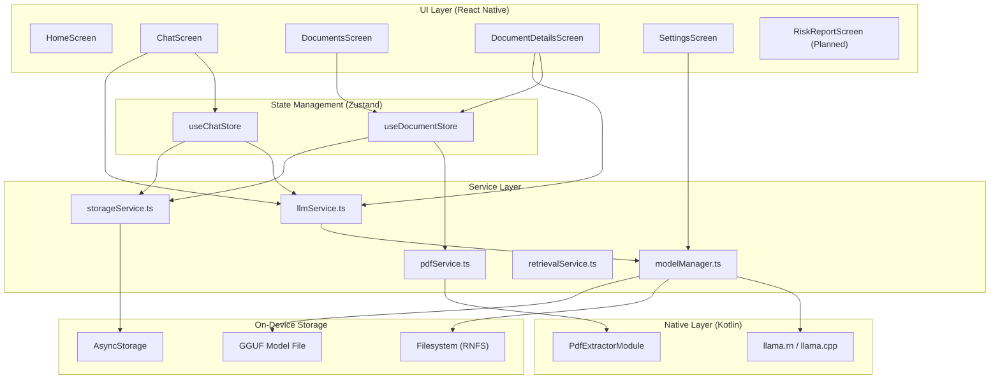

# Mobile Legal AI Assistant

## Goal

Provide a fully offline AI assistant specialized in Indian Law for legal document analysis on Android. All processing happens on-device — no cloud, no internet required after model download.

## System Architecture Overview

## Current Features (Phase 1–7 Complete)

### Chat

- User enters a legal question
- Local LLM generates a response grounded in Indian legal framework
- Streaming token display with real-time typing animation
- Stop/cancel button to abort generation mid-response

### Document Upload

- Upload PDF files via native document picker
- Extract text offline using custom PdfExtractor native module (PDFBox)
- Store documents locally with AsyncStorage persistence

### Document Summarization

- Generate AI summary of uploaded PDF
- Chunk-based processing for large documents

### Ask Document (RAG)

- Ask questions about uploaded PDF
- BM25 retrieval finds the most relevant chunks
- Chunks are labeled with `[Chunk X]` for source tracking

Examples:

- What is clause 5?
- Who are the parties involved?
- What are the important dates?
- What are the termination conditions under Indian law?

### Model Management

- Download GGUF models directly from Hugging Face
- Switch between 3 model options:
  - Qwen 2.5 3B (Recommended) — 1.96 GB
  - Qwen 2.5 1.5B (Light) — 1.13 GB
  - Llama 3.2 1B (Ultra-Light) — 0.81 GB
- Persistent model preference across app restarts
- Auto-load last used model on startup
- Load/Unload model manually from Settings

### Indian Law Specialization

- System prompts reference: Constitution of India, BNS/IPC, CrPC/BNSS, IEA/BSA, CPC
- All AI responses are grounded in Indian legal context
- Disclaimer: responses are informational only, not legal advice

## Planned Features (Phase 8–17)

```mermaid
graph LR
    P8["Phase 8\nProduction\nHardening"] --> P85["Phase 8.5\nRetrieval\nBenchmark"]
    P85 --> P86["Phase 8.6\nHallucination\nDetection"]
    P86 --> P87["Phase 8.7\nCitation\nEngine"]
    P87 --> P9["Phase 9\nEvaluation\nFramework"]
    P9 --> P105["Phase 10.5\nCorpus\nManager"]
    P105 --> P115["Phase 11.5\nConversation\nMemory"]
    P115 --> P13["Phase 13\nRisk\nAnalyzer"]
    P13 --> P15["Phase 15\nELI5\nMode"]
    P15 --> P16["Phase 16\nPerformance\nDashboard"]
    P16 --> P17["Phase 17\nSecurity\n& Privacy"]

    style P8 fill:#ff9800,color:#000
    style P85 fill:#ff9800,color:#000
    style P86 fill:#ff9800,color:#000
    style P87 fill:#ff9800,color:#000
    style P9 fill:#2196f3,color:#fff
    style P105 fill:#2196f3,color:#fff
    style P115 fill:#4caf50,color:#fff
    style P13 fill:#4caf50,color:#fff
    style P15 fill:#4caf50,color:#fff
    style P16 fill:#9c27b0,color:#fff
    style P17 fill:#9c27b0,color:#fff
```

- Production hardening (crash recovery, context budget, citation engine)
- Retrieval quality evaluation and hallucination detection
- Built-in Indian legal knowledge base (Constitution, BNS, BNSS, BSA, CPC, RTI)
- Conversation memory for follow-up questions
- Legal risk analyzer for contracts
- Document comparison (V1 vs V2 diff)
- Plain English / ELI5 explanation mode
- Performance telemetry dashboard
- Encrypted storage and privacy controls

## Not Included (Deferred)

- Cloud sync
- User accounts
- Multi-user support
- Online AI APIs
- Voice input/output (Phase 12 — future)
- OCR for scanned documents

## Target Device

- Android (6 GB+ RAM recommended)
- Tested on Android 17 (API 36) emulator

## Local Models

- Qwen 2.5 3B Instruct GGUF (Q4_K_M) — primary
- Qwen 2.5 1.5B Instruct GGUF (Q4_K_M) — lightweight
- Llama 3.2 1B Instruct GGUF (Q4_K_M) — ultra-light
