# Mobile Legal AI Assistant — Project Overview

> **Branch:** `javascript` — React Native 0.85 / JavaScript implementation
> **Platform:** Android (primary), iOS (secondary)
> **Architecture:** Fully offline — no cloud, no internet required after initial model download

---

## 🎯 Goal

Provide a **fully offline, on-device AI legal assistant** specialized in **Indian Law** for legal professionals and individuals on Android. All AI processing, document parsing, and storage happens locally — your legal documents never leave the device.

---

## 🏗️ High-Level Architecture

```mermaid
graph TB
    subgraph UI["UI Layer (React Native / JSX)"]
        HS["HomeScreen"]
        CS["CasesScreen"]
        CD["CaseDetailsScreen"]
        CHT["ChatScreen"]
        DS["DocumentsScreen"]
        DDS["DocumentDetailsScreen"]
        SS["SettingsScreen"]
        ANA["Analysis Screens (10+)"]
    end

    subgraph State["State Management (Zustand v5)"]
        CaseStore["useCaseStore — Case folders, notes, tags"]
        ChatStore["useChatStore — Chat history per-case"]
        DocStore["useDocumentStore — PDF metadata + chunks"]
    end

    subgraph Services["Service Layer (JavaScript)"]
        LLM["llmService.js — LLM inference API"]
        MM["modelManager.js — Model lifecycle singleton"]
        PDF["pdfService.js — PDF text extraction + chunking"]
        RET["retrievalService.js — BM25 keyword retrieval"]
        STG["storageService.js — RNFS file I/O"]
        CTX["contextBudget.js — Token budget manager"]
        TEL["telemetry.js — Performance tracker"]
        SEC["secureStorage.js — AES-256 crypto-js storage"]
        Analyzers["10+ AI Analyzer Services"]
    end

    subgraph Native["Native Layer (Kotlin / C++)"]
        PE["PdfExtractorModule (Kotlin + Apache PDFBox)"]
        LLAMA["llama.rn → llama.cpp (C++)"]
    end

    subgraph Storage["On-Device Storage"]
        AS["AsyncStorage — Encrypted via crypto-js"]
        FS["RNFS (react-native-fs) — Filesystem access"]
        MODEL["GGUF Model File (~0.8–2 GB)"]
        DOCS["Extracted PDF text chunks"]
    end

    UI --> State
    State --> Services
    Services --> Native
    Services --> Storage
    Native --> Storage
```



---

## 🔄 Request Lifecycle (Chat Example)

```
User Types Message
       ↓
ChatScreen.jsx → useChatStore.addMessage()
       ↓
llmService.generateResponse(prompt, history, perspective, caseType)
       ↓
modelManager.getContext() → llama.rn context
       ↓
context.completion({ messages, n_predict: 1024, temperature: 0.7 })
       ↓
Streaming tokens → onToken() callback → UI updates in real-time
       ↓
telemetry.recordInference(tokens, duration)
       ↓
Complete text returned → stored in useChatStore
```

---

## 📦 Technology Stack

| Layer | Technology |
|---|---|
| Framework | React Native 0.85.3 |
| Language | JavaScript (JSX) |
| State Management | Zustand v5 (with `persist` middleware) |
| Navigation | React Navigation 7 (Native Stack) |
| LLM Runtime | llama.rn v0.12.4 (bindings for llama.cpp) |
| PDF Extraction | Native Kotlin module + Apache PDFBox |
| Retrieval | Custom BM25 implementation (zero dependencies) |
| Storage | AsyncStorage + react-native-fs + AES-256 crypto-js |
| Testing | Jest 29 (unit) + custom JS stress/fuzz/soak test runners |
| Linting | ESLint + Prettier |
| Min Node | ≥ 22.11.0 |

---

## 🤖 Supported AI Models

All models run **100% on-device** via llama.cpp/llama.rn:

| Model | Size | RAM Requirement | Notes |
|---|---|---|---|
| Qwen 2.5 3B Instruct Q4_K_M | 1.96 GB | 6 GB+ recommended | Best quality & reasoning |
| Qwen 2.5 1.5B Instruct Q4_K_M | 1.13 GB | 4 GB+ | Balanced speed/quality |
| Llama 3.2 1B Instruct Q4_K_M | 0.81 GB | 3 GB+ | Ultra-fast, minimal footprint |

**Inference Parameters:**
- **Context Window:** 2048 tokens (n_ctx) — conservative for device safety
- **CPU-only inference** — `n_gpu_layers: 0` (Adreno GPU crashes on flash attention)
- **use_mlock: true** — prevents OS from paging model weights to disk
- **Prompt Format:** Qwen 2.5 ChatML (`<|im_start|>` / `<|im_end|>`)

---

## 🇮🇳 Indian Law Specialization

All LLM system prompts explicitly reference the Indian legal framework:
- **Constitution of India**
- **Bharatiya Nyaya Sanhita (BNS) / Indian Penal Code (IPC)**
- **Code of Criminal Procedure (CrPC) / Bharatiya Nagarik Suraksha Sanhita (BNSS)**
- **Indian Evidence Act (IEA) / Bharatiya Sakshya Adhiniyam (BSA)**
- **Code of Civil Procedure (CPC)**
- **RTI Act, Arbitration and Conciliation Act, and other Indian acts**

---

## 📁 Branch Scope

The `javascript` branch contains the complete React Native + JavaScript implementation with **26 completed phases** covering all core AI analysis features, evaluation pipelines, and testing infrastructure.
