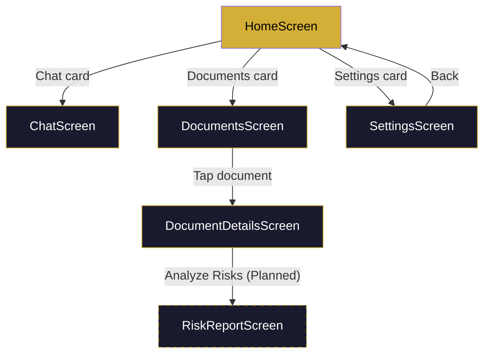
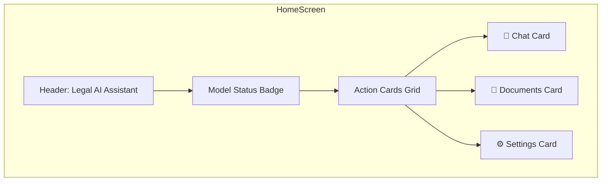
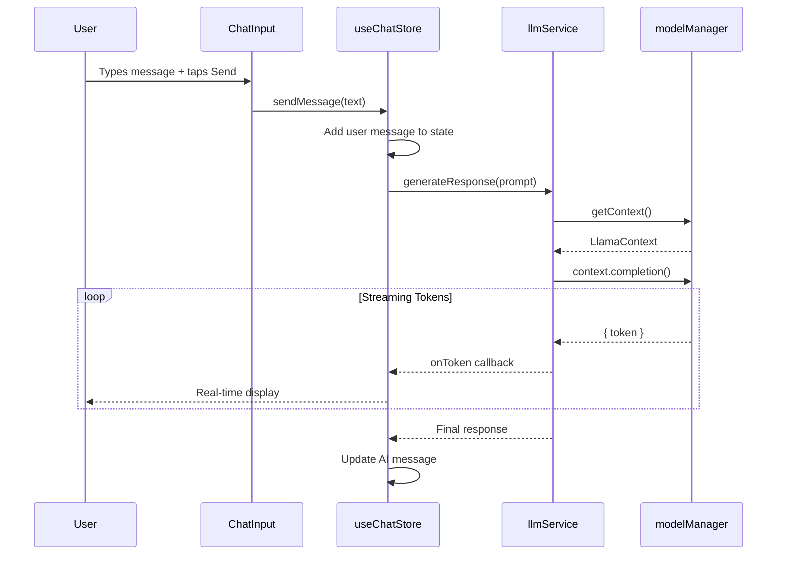
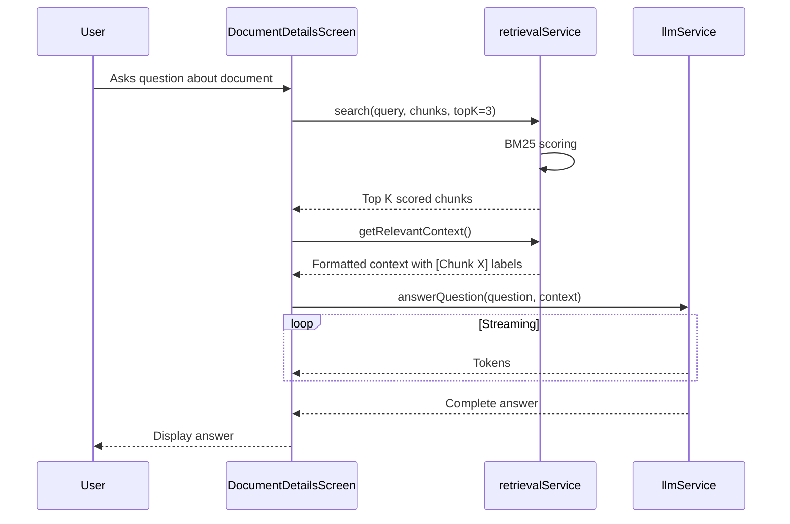
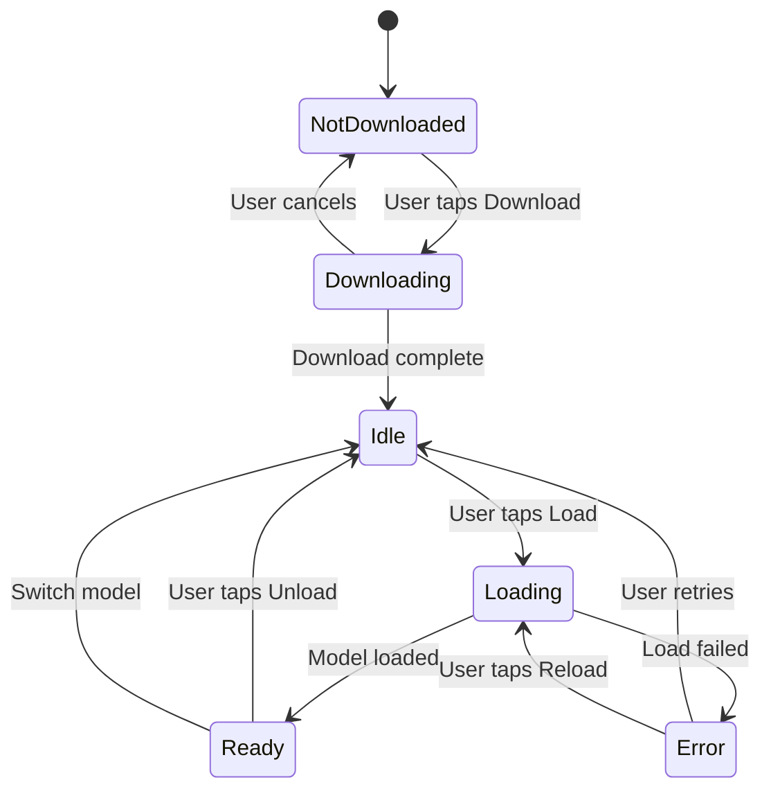

# App Screens

## Screen Navigation Map

---

## 1. Home Screen

Features:

- Quick-action cards: Chat, Documents, Settings
- AI model status badge (Ready / Loading / Idle / Error / Downloading)
- App branding and tagline

---

## 2. Chat Screen

Features:

- Scrollable message list (FlatList)
- User and AI message bubbles with distinct styling
- Text input with send button
- Stop/cancel button (red) appears during AI generation
- Loading indicator: "AI is thinking..."
- ELI5 mode toggle (Phase 15 — planned)
- Source citation panel below AI messages (Phase 8.7 — planned)
- Hallucination warning banner (Phase 8.6 — planned)

---

## 3. Documents Screen

Features:

- Upload PDF via native document picker
- List all stored documents with file size and date
- Delete individual documents with swipe or tap
- Navigate to Document Details

---

## 4. Document Details Screen

Features:

- View document name, size, chunk count
- Generate AI summary (streaming)
- Ask questions about the document (RAG with BM25 retrieval)
- View extracted text chunks
- Analyze Risks button (Phase 13 — planned)

---

## 5. Settings Screen

Features:

- **Change Active Model** card — select from 3 model options with size badges
- **AI Model Controller** card — shows active model name, format, engine, status
  - Download model button with progress bar
  - Load / Unload model buttons
  - Cancel download button
- **Storage Info** card — document count, total size
- **Performance Dashboard** (Phase 16 — planned)
- **Privacy & Security** controls (Phase 17 — planned)
- **Danger Zone** — clear all documents, clear chat history

---

## 6. Risk Report Screen (Phase 13 — Planned)

Features:

- Color-coded risk cards (red=high, amber=medium, green=low)
- Missing clauses section
- Recommendations list
- Accessed from Document Details Screen
