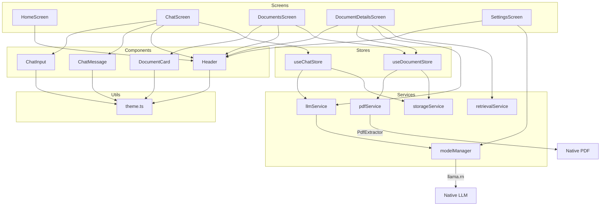
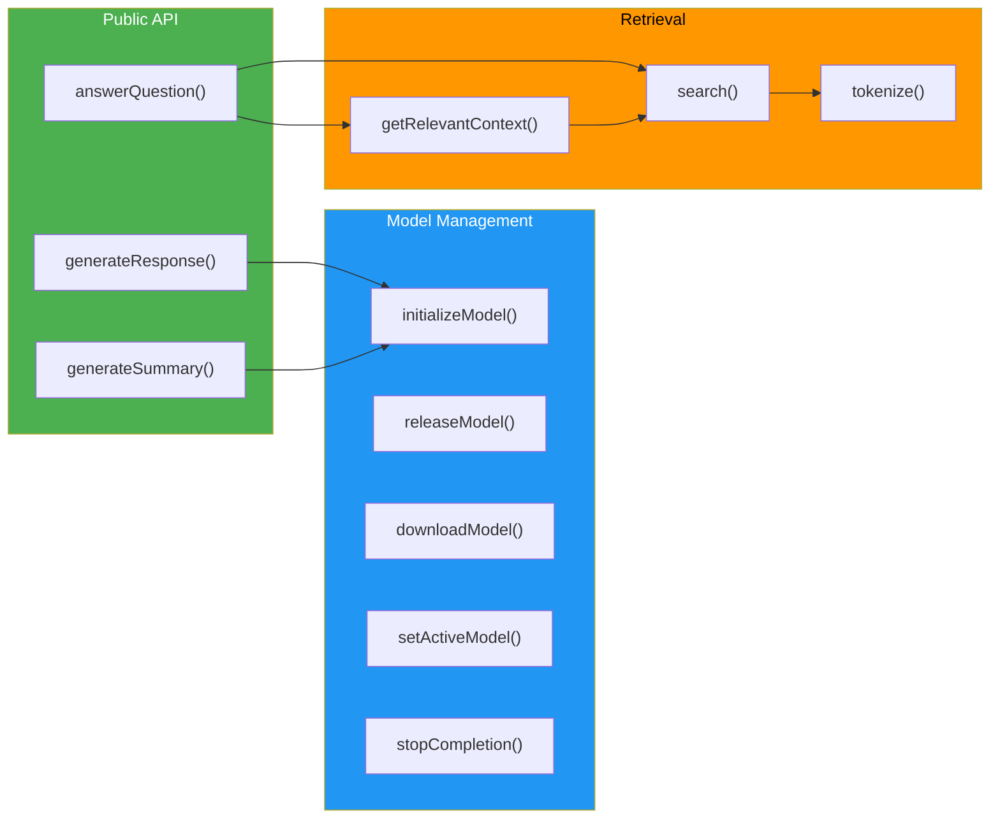

# Folder Structure

```
mobile-legal-ai-assistant/
│
├── docs/                                    # Project documentation
│   ├── 01-project-overview.md
│   ├── 02-app-screens.md
│   ├── 03-folder-structure.md
│   ├── 04-data-flow.md
│   ├── 05-tech-stack.md
│   ├── 06-document-processing.md
│   └── 07-roadmap.md
│
├── LegalAI/                                 # React Native project root
│   │
│   ├── android/                             # Android native code
│   │   └── app/src/main/java/com/legalai/
│   │       ├── PdfExtractorModule.kt        # Native PDF text extraction
│   │       └── PdfExtractorPackage.kt       # Module registration
│   │
│   ├── src/
│   │   ├── screens/
│   │   │   ├── HomeScreen.tsx
│   │   │   ├── ChatScreen.tsx
│   │   │   ├── DocumentsScreen.tsx
│   │   │   ├── DocumentDetailsScreen.tsx
│   │   │   ├── SettingsScreen.tsx
│   │   │   └── RiskReportScreen.tsx          # Phase 13 — planned
│   │   │
│   │   ├── components/
│   │   │   ├── ChatMessage.tsx
│   │   │   ├── ChatInput.tsx
│   │   │   ├── DocumentCard.tsx
│   │   │   ├── Header.tsx
│   │   │   └── CitationPanel.tsx             # Phase 8.7 — planned
│   │   │
│   │   ├── navigation/
│   │   │   └── AppNavigator.tsx
│   │   │
│   │   ├── services/
│   │   │   ├── llmService.ts                # LLM inference API
│   │   │   ├── modelManager.ts              # Model lifecycle singleton
│   │   │   ├── pdfService.ts                # PDF extraction & chunking
│   │   │   ├── retrievalService.ts          # BM25 text retrieval
│   │   │   ├── storageService.ts            # AsyncStorage persistence
│   │   │   ├── contextBudget.ts             # Phase 8 — planned
│   │   │   ├── answerVerifier.ts            # Phase 8.6 — planned
│   │   │   ├── corpusManager.ts             # Phase 10.5 — planned
│   │   │   ├── riskAnalyzer.ts              # Phase 13 — planned
│   │   │   ├── telemetry.ts                 # Phase 16 — planned
│   │   │   └── secureStorage.ts             # Phase 17 — planned
│   │   │
│   │   ├── store/
│   │   │   ├── useChatStore.ts              # Zustand chat state
│   │   │   └── useDocumentStore.ts          # Zustand document state
│   │   │
│   │   ├── evaluation/                      # Phase 8.5/9 — planned
│   │   │   ├── retrievalBenchmark.ts
│   │   │   ├── performanceBenchmark.ts
│   │   │   ├── benchmarkQuestions.json
│   │   │   └── benchmarkDocuments/
│   │   │
│   │   ├── utils/
│   │   │   ├── theme.ts                     # Design tokens (colors, fonts, spacing)
│   │   │   └── textCleaner.ts               # Phase 8 — planned
│   │   │
│   │   ├── types/                           # TypeScript type definitions
│   │   │
│   │   └── assets/
│   │       └── legal/                       # Phase 10.5 — planned
│   │           ├── constitution/
│   │           ├── bns/
│   │           ├── bnss/
│   │           ├── bsa/
│   │           ├── cpc/
│   │           ├── consumer_protection/
│   │           └── rti/
│   │
│   ├── App.tsx                              # Root component
│   ├── package.json
│   └── tsconfig.json
│
└── README.md
```

## Module Dependency Diagram



## Service Layer Architecture



