# Data Flow

## High-Level Data Flow Overview

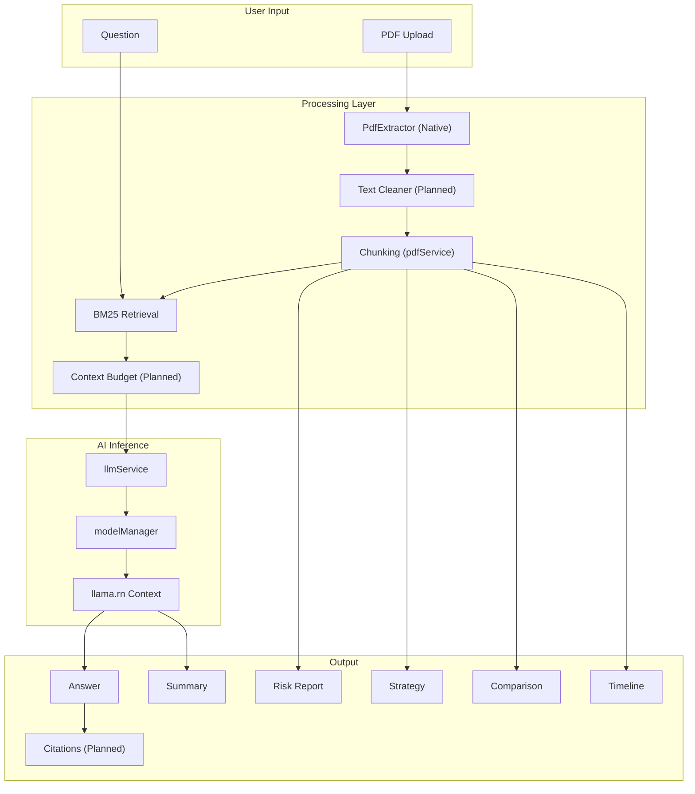
```mermaid
graph TB
    subgraph Input["User Input"]
        Q["Question"]
        PDF["PDF Upload"]
    end

    subgraph Processing["Processing Layer"]
        PE["PdfExtractor (Native)"]
        CHUNK["Chunking (pdfService)"]
        BM25["BM25 Retrieval"]
        CB["Context Budget (Planned)"]
        CLEAN["Text Cleaner (Planned)"]
    end

    subgraph AI["AI Inference"]
        LLM["llmService"]
        MM["modelManager"]
        LLAMA["llama.rn Context"]
    end

    subgraph Output["Output"]
        ANS["Answer"]
        SUM["Summary"]
        CIT["Citations (Planned)"]
        RISK["Risk Report"]
        STRAT["Strategy"]
        COMPARE["Comparison"]
        TIMELINE["Timeline"]
    end

    PDF --> PE --> CLEAN --> CHUNK
    Q --> BM25
    CHUNK --> BM25
    BM25 --> CB --> LLM
    LLM --> MM --> LLAMA
    LLAMA --> ANS
    LLAMA --> SUM
    ANS --> CIT
    CHUNK --> RISK
    CHUNK --> STRAT
    CHUNK --> COMPARE
    CHUNK --> TIMELINE
```

---

## Chat Flow

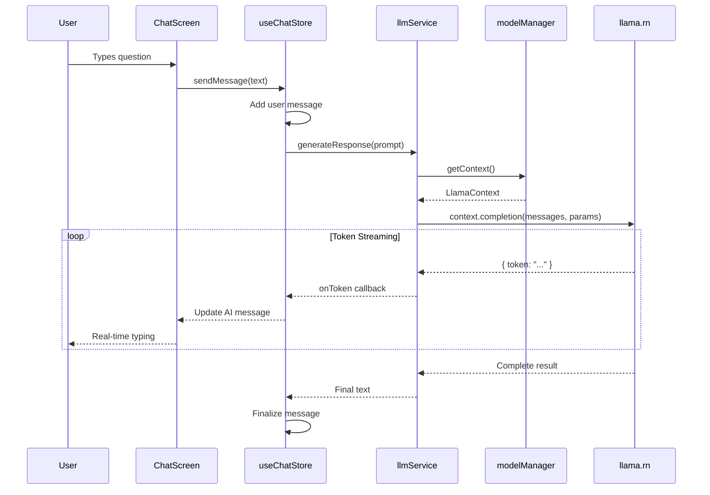
```mermaid
sequenceDiagram
    participant User
    participant ChatScreen
    participant useChatStore
    participant llmService
    participant modelManager
    participant llama.rn

    User->>ChatScreen: Types question
    ChatScreen->>useChatStore: sendMessage(text)
    useChatStore->>useChatStore: Add user message
    useChatStore->>llmService: generateResponse(prompt)
    llmService->>modelManager: getContext()
    modelManager-->>llmService: LlamaContext

    llmService->>llama.rn: context.completion(messages, params)

    loop Token Streaming
        llama.rn-->>llmService: { token: "..." }
        llmService-->>useChatStore: onToken callback
        useChatStore-->>ChatScreen: Update AI message
        ChatScreen-->>User: Real-time typing
    end

    llama.rn-->>llmService: Complete result
    llmService-->>useChatStore: Final text
    useChatStore->>useChatStore: Finalize message
```

---

## PDF Upload Flow

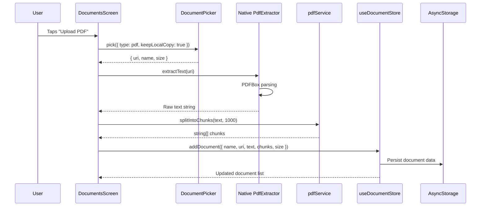
```mermaid
sequenceDiagram
    participant User
    participant DocScreen as DocumentsScreen
    participant Picker as DocumentPicker
    participant PdfExtractor as Native PdfExtractor
    participant pdfService
    participant docStore as useDocumentStore
    participant AsyncStorage

    User->>DocScreen: Taps "Upload PDF"
    DocScreen->>Picker: pick({ type: pdf, keepLocalCopy: true })
    Picker-->>DocScreen: { uri, name, size }
    DocScreen->>PdfExtractor: extractText(uri)
    PdfExtractor->>PdfExtractor: PDFBox parsing
    PdfExtractor-->>DocScreen: Raw text string
    DocScreen->>pdfService: splitIntoChunks(text, 1000)
    pdfService-->>DocScreen: string[] chunks
    DocScreen->>docStore: addDocument({ name, uri, text, chunks, size })
    docStore->>AsyncStorage: Persist document data
    docStore-->>DocScreen: Updated document list
```

---

## PDF Question Answering Flow (RAG)

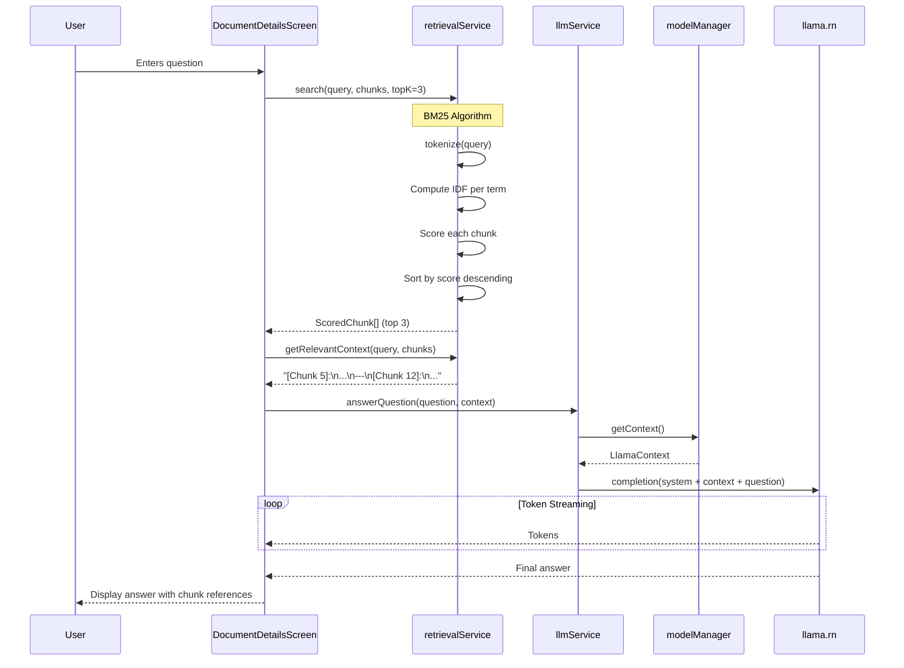
```mermaid
sequenceDiagram
    participant User
    participant DDS as DocumentDetailsScreen
    participant retrieval as retrievalService
    participant llmService
    participant modelManager
    participant llama.rn

    User->>DDS: Enters question
    DDS->>retrieval: search(query, chunks, topK=3)

    Note over retrieval: BM25 Algorithm
    retrieval->>retrieval: tokenize(query)
    retrieval->>retrieval: Compute IDF per term
    retrieval->>retrieval: Score each chunk
    retrieval->>retrieval: Sort by score descending

    retrieval-->>DDS: ScoredChunk[] (top 3)
    DDS->>retrieval: getRelevantContext(query, chunks)
    retrieval-->>DDS: "[Chunk 5]:\n...\n---\n[Chunk 12]:\n..."

    DDS->>llmService: answerQuestion(question, context)
    llmService->>modelManager: getContext()
    modelManager-->>llmService: LlamaContext
    llmService->>llama.rn: completion(system + context + question)

    loop Token Streaming
        llama.rn-->>DDS: Tokens
    end
    llama.rn-->>DDS: Final answer
    DDS-->>User: Display answer with chunk references
```

---

## Model Lifecycle Flow

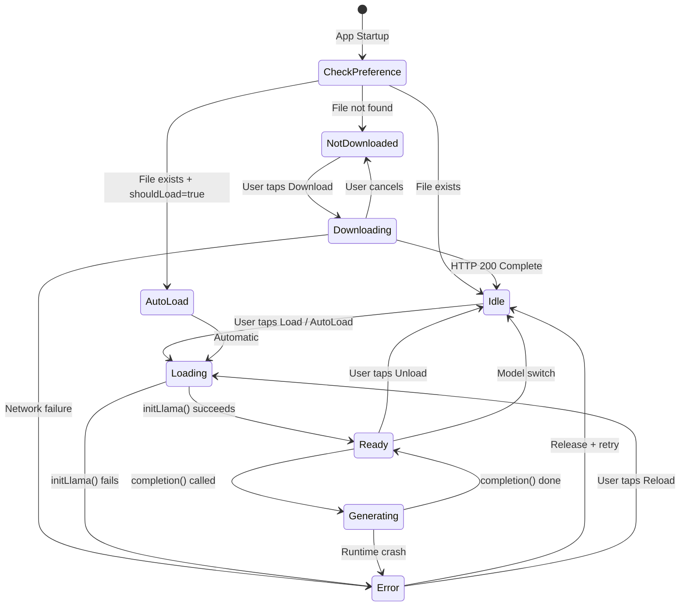
```mermaid
stateDiagram-v2
    [*] --> CheckPreference: App Startup
    CheckPreference --> NotDownloaded: File not found
    CheckPreference --> Idle: File exists
    CheckPreference --> AutoLoad: File exists + shouldLoad=true

    NotDownloaded --> Downloading: User taps Download
    Downloading --> Idle: HTTP 200 Complete
    Downloading --> NotDownloaded: User cancels
    Downloading --> Error: Network failure

    Idle --> Loading: User taps Load / AutoLoad
    AutoLoad --> Loading: Automatic
    Loading --> Ready: initLlama() succeeds
    Loading --> Error: initLlama() fails

    Ready --> Generating: completion() called
    Generating --> Ready: completion() done
    Generating --> Error: Runtime crash

    Ready --> Idle: User taps Unload
    Ready --> Idle: Model switch

    Error --> Idle: Release + retry
    Error --> Loading: User taps Reload
```

---

## Model Download Flow

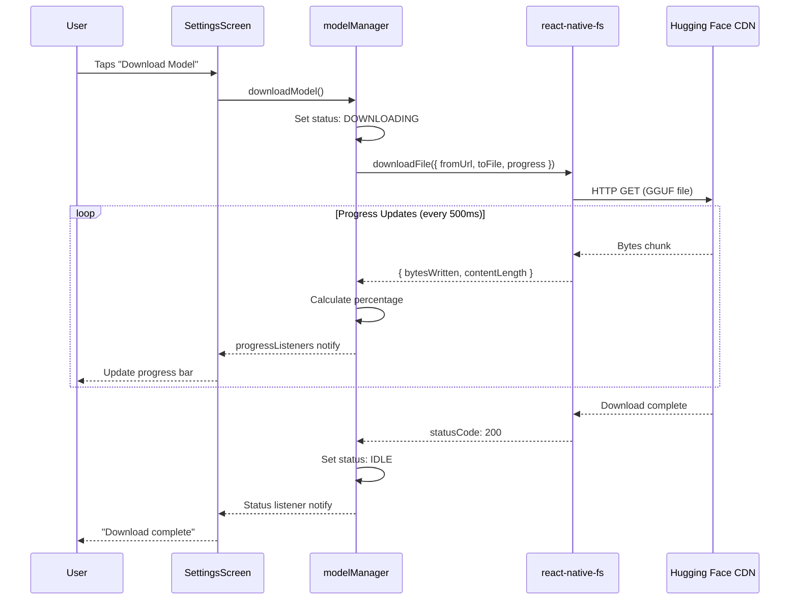
```mermaid
sequenceDiagram
    participant User
    participant Settings as SettingsScreen
    participant MM as modelManager
    participant RNFS as react-native-fs
    participant HF as Hugging Face CDN

    User->>Settings: Taps "Download Model"
    Settings->>MM: downloadModel()
    MM->>MM: Set status: DOWNLOADING
    MM->>RNFS: downloadFile({ fromUrl, toFile, progress })
    RNFS->>HF: HTTP GET (GGUF file)

    loop Progress Updates (every 500ms)
        HF-->>RNFS: Bytes chunk
        RNFS-->>MM: { bytesWritten, contentLength }
        MM->>MM: Calculate percentage
        MM-->>Settings: progressListeners notify
        Settings-->>User: Update progress bar
    end

    HF-->>RNFS: Download complete
    RNFS-->>MM: statusCode: 200
    MM->>MM: Set status: IDLE
    MM-->>Settings: Status listener notify
    Settings-->>User: "Download complete"
```

---

## Model Switching Flow

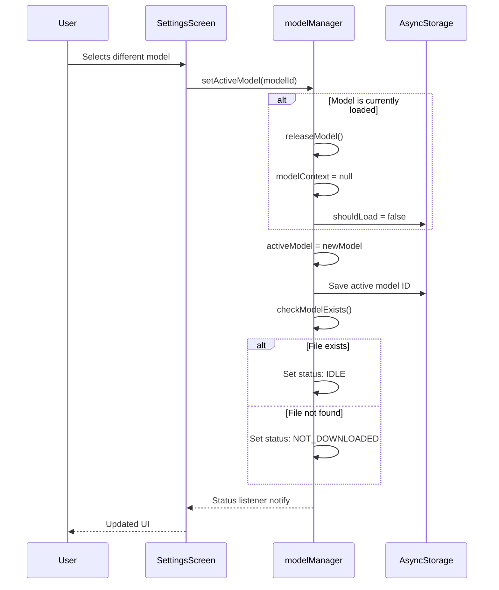
```mermaid
sequenceDiagram
    participant User
    participant Settings as SettingsScreen
    participant MM as modelManager
    participant AsyncStorage

    User->>Settings: Selects different model
    Settings->>MM: setActiveModel(modelId)

    alt Model is currently loaded
        MM->>MM: releaseModel()
        MM->>MM: modelContext = null
        MM->>AsyncStorage: shouldLoad = false
    end

    MM->>MM: activeModel = newModel
    MM->>AsyncStorage: Save active model ID
    MM->>MM: checkModelExists()

    alt File exists
        MM->>MM: Set status: IDLE
    else File not found
        MM->>MM: Set status: NOT_DOWNLOADED
    end

    MM-->>Settings: Status listener notify
    Settings-->>User: Updated UI
```

---

## Crash Recovery Flow (Phase 8 — Planned)

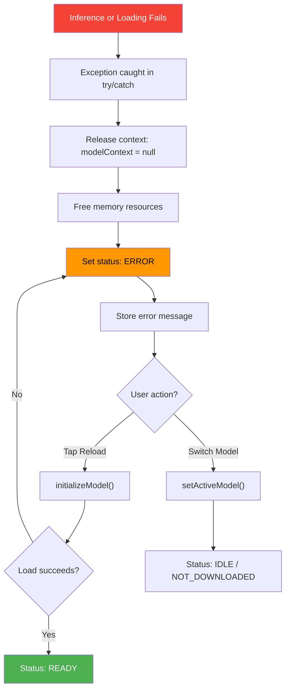
```mermaid
flowchart TD
    A["Inference or Loading Fails"] --> B["Exception caught in try/catch"]
    B --> C["Release context: modelContext = null"]
    C --> D["Free memory resources"]
    D --> E["Set status: ERROR"]
    E --> F["Store error message"]
    F --> G{"User action?"}
    G -->|"Tap Reload"| H["initializeModel()"]
    G -->|"Switch Model"| I["setActiveModel()"]
    H --> J{"Load succeeds?"}
    J -->|Yes| K["Status: READY"]
    J -->|No| E
    I --> L["Status: IDLE / NOT_DOWNLOADED"]

    style A fill:#f44336,color:#fff
    style E fill:#ff9800,color:#000
    style K fill:#4caf50,color:#fff
```

---

## Hallucination Verification Flow (Phase 8.6 — Planned)

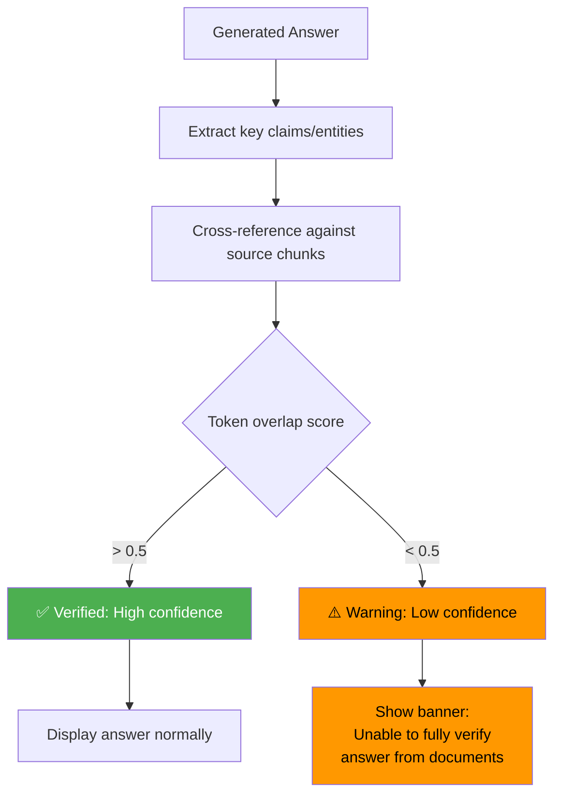
```mermaid
flowchart TD
    A["Generated Answer"] --> B["Extract key claims/entities"]
    B --> C["Cross-reference against source chunks"]
    C --> D{"Token overlap score"}
    D -->|"> 0.5"| E["✅ Verified: High confidence"]
    D -->|"< 0.5"| F["⚠️ Warning: Low confidence"]
    F --> G["Show banner:\nUnable to fully verify\nanswer from documents"]
    E --> H["Display answer normally"]

    style E fill:#4caf50,color:#fff
    style F fill:#ff9800,color:#000
    style G fill:#ff9800,color:#000
```

---

## Risk Analysis & Legal Audit Flow

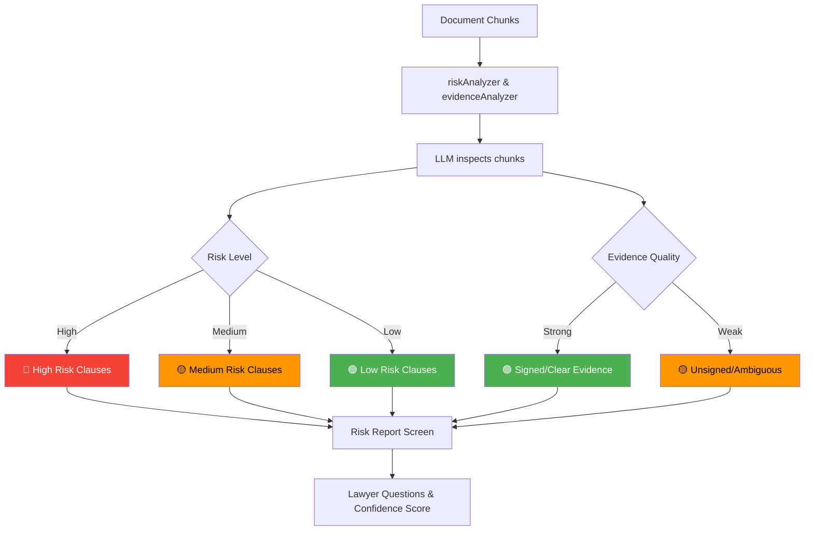
```mermaid
flowchart TD
    A["Document Chunks"] --> B["riskAnalyzer & evidenceAnalyzer"]
    B --> C["LLM inspects chunks"]
    C --> D{"Risk Level"}
    D -->|"High"| E["🔴 High Risk Clauses"]
    D -->|"Medium"| F["🟡 Medium Risk Clauses"]
    D -->|"Low"| G["🟢 Low Risk Clauses"]
    
    C --> H{"Evidence Quality"}
    H -->|"Strong"| I["🟢 Signed/Clear Evidence"]
    H -->|"Weak"| J["🟡 Unsigned/Ambiguous"]
    
    E --> K["Risk Report Screen"]
    F --> K
    G --> K
    I --> K
    J --> K
    K --> L["Lawyer Questions & Confidence Score"]

    style E fill:#f44336,color:#fff
    style F fill:#ff9800,color:#000
    style G fill:#4caf50,color:#fff
    style I fill:#4caf50,color:#fff
    style J fill:#ff9800,color:#000
```

---

## Legal Strategy Generation Flow

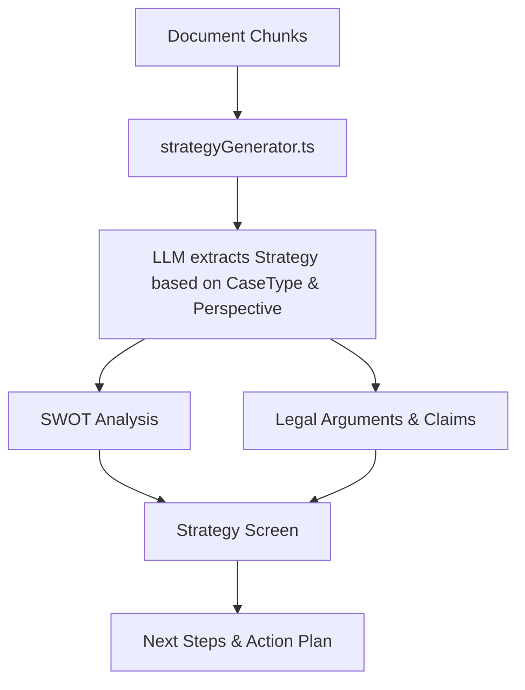
```mermaid
flowchart TD
    A["Document Chunks"] --> B["strategyGenerator.ts"]
    B --> C["LLM extracts Strategy based on CaseType & Perspective"]
    C --> D["SWOT Analysis"]
    C --> E["Legal Arguments & Claims"]
    D --> F["Strategy Screen"]
    E --> F
    F --> G["Next Steps & Action Plan"]
```

---

## Multi-Perspective Comparison Flow

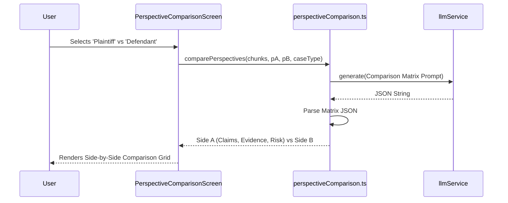
```mermaid
sequenceDiagram
    participant User
    participant PCS as PerspectiveComparisonScreen
    participant PC as perspectiveComparison.ts
    participant LLM as llmService
    
    User->>PCS: Selects 'Plaintiff' vs 'Defendant'
    PCS->>PC: comparePerspectives(chunks, pA, pB, caseType)
    PC->>LLM: generate(Comparison Matrix Prompt)
    LLM-->>PC: JSON String
    PC->>PC: Parse Matrix JSON
    PC-->>PCS: Side A (Claims, Evidence, Risk) vs Side B
    PCS-->>User: Renders Side-by-Side Comparison Grid
```

---

## Multi-Document Timeline Flow

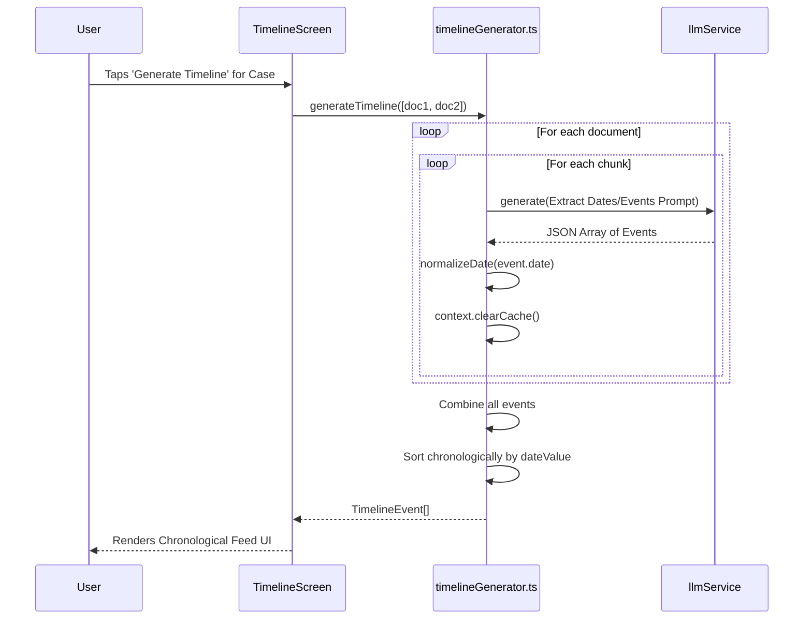
```mermaid
sequenceDiagram
    participant User
    participant TS as TimelineScreen
    participant TG as timelineGenerator.ts
    participant LLM as llmService
    
    User->>TS: Taps 'Generate Timeline' for Case
    TS->>TG: generateTimeline([doc1, doc2])
    
    loop For each document
        loop For each chunk
            TG->>LLM: generate(Extract Dates/Events Prompt)
            LLM-->>TG: JSON Array of Events
            TG->>TG: normalizeDate(event.date)
            TG->>TG: context.clearCache()
        end
    end
    
    TG->>TG: Combine all events
    TG->>TG: Sort chronologically by dateValue
    TG-->>TS: TimelineEvent[]
    TS-->>User: Renders Chronological Feed UI
```

---

## Conversation Memory Flow (Phase 11.5 — Planned)

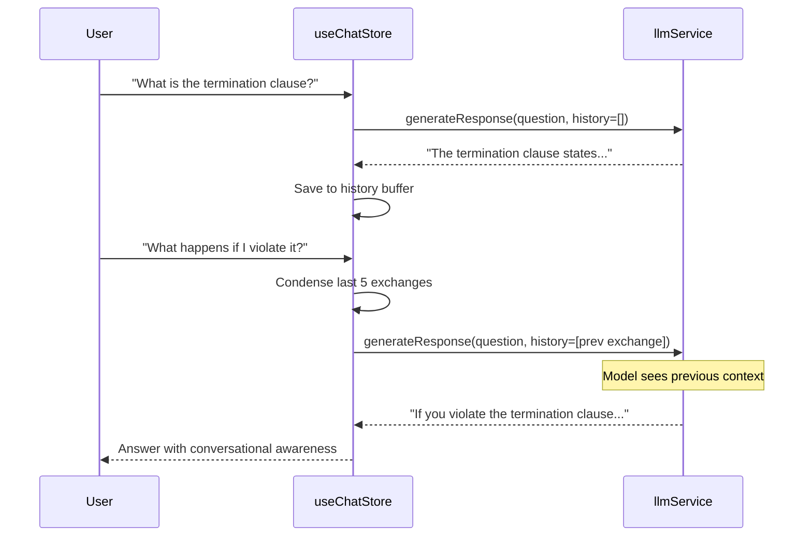
```mermaid
sequenceDiagram
    participant User
    participant Store as useChatStore
    participant LLM as llmService

    User->>Store: "What is the termination clause?"
    Store->>LLM: generateResponse(question, history=[])
    LLM-->>Store: "The termination clause states..."
    Store->>Store: Save to history buffer

    User->>Store: "What happens if I violate it?"
    Store->>Store: Condense last 5 exchanges
    Store->>LLM: generateResponse(question, history=[prev exchange])

    Note over LLM: Model sees previous context
    LLM-->>Store: "If you violate the termination clause..."
    Store-->>User: Answer with conversational awareness
```

---

## Context Budget Flow (Phase 8 — Planned)

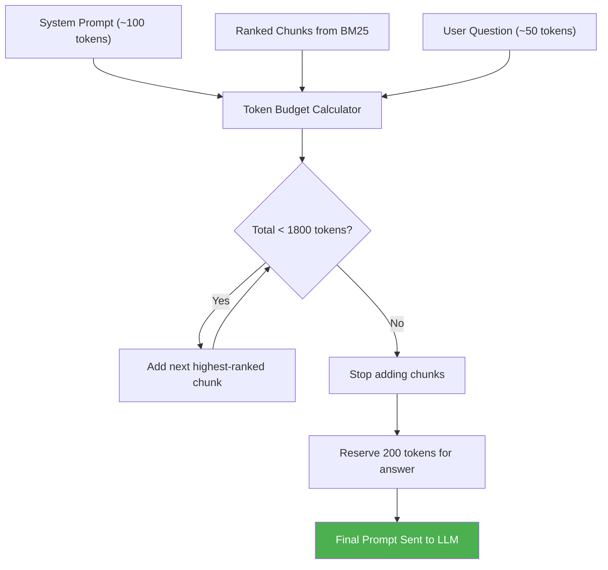
```mermaid
flowchart TD
    A["System Prompt (~100 tokens)"] --> E["Token Budget Calculator"]
    B["Ranked Chunks from BM25"] --> E
    C["User Question (~50 tokens)"] --> E
    E --> F{"Total < 1800 tokens?"}
    F -->|Yes| G["Add next highest-ranked chunk"]
    G --> F
    F -->|No| H["Stop adding chunks"]
    H --> I["Reserve 200 tokens for answer"]
    I --> J["Final Prompt Sent to LLM"]

    style J fill:#4caf50,color:#fff
```
