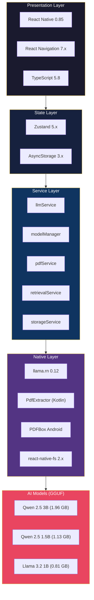
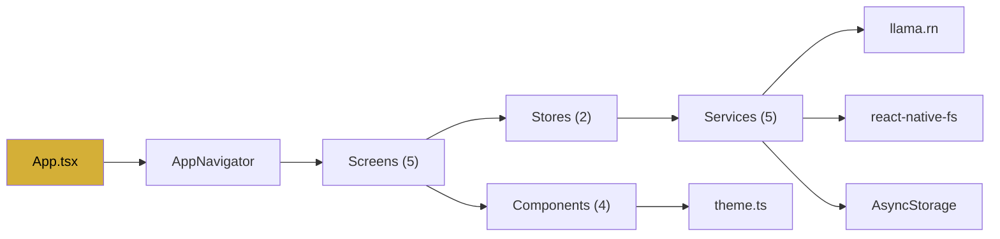

# Tech Stack

## Stack Overview

---

## Frontend

- React Native 0.85.3
- React 19.2.3
- React Navigation 7.x (Native Stack)
- TypeScript 5.8.3

## State Management

- Zustand 5.x (lightweight store with selectors)

## Local Storage

- @react-native-async-storage/async-storage 3.x
- react-native-encrypted-storage (Phase 17 — planned)

## File Handling

- @react-native-documents/picker 12.x (SAF-compatible document picker)
- react-native-fs 2.x (filesystem access, model downloads)

## PDF Processing

- Custom PdfExtractor native module (Kotlin)
- PDFBox Android (com.tom-roush:pdfbox-android) for offline text extraction

## Local AI Inference

- llama.rn 0.12.x (React Native bindings for llama.cpp)
- GGUF model format (Q4_K_M quantization)

## Available Models

| Model | Size | RAM Required | Use Case |
| :--- | :--- | :--- | :--- |
| Qwen 2.5 3B Instruct | 1.96 GB | 6 GB+ | Best quality — recommended |
| Qwen 2.5 1.5B Instruct | 1.13 GB | 4 GB+ | Balanced — lower memory |
| Llama 3.2 1B Instruct | 0.81 GB | 3 GB+ | Ultra-light — fits all devices |

## Text Retrieval

- BM25 (pure TypeScript, zero dependencies)
- Hybrid BM25 + Embeddings (Phase 11 — planned)

## UI Framework

- react-native-safe-area-context 5.x
- react-native-screens 4.x
- Custom design system (theme.ts with COLORS, FONTS, SPACING, RADIUS tokens)

## Development

- Git
- npm
- Android Studio (Ladybug)
- Android SDK 36 (API level 36)
- Gradle 9.3.1

## Dependency Graph

