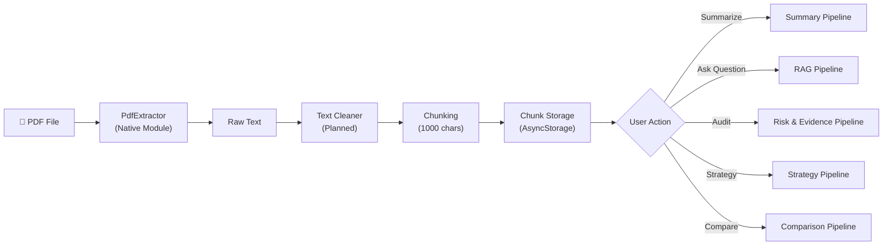
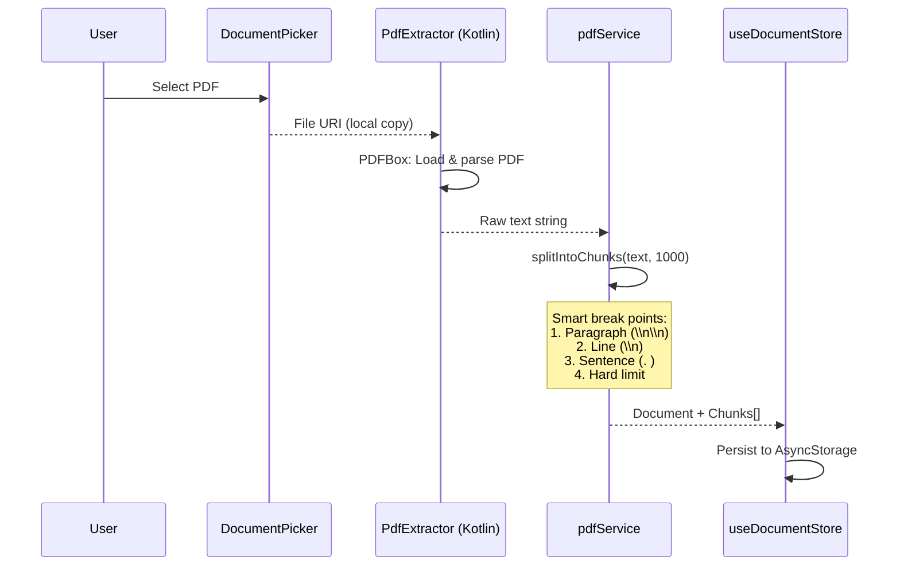
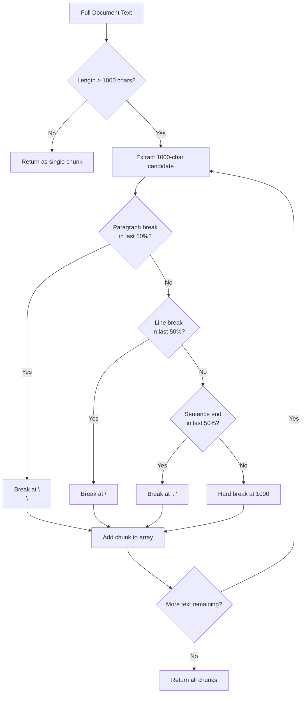
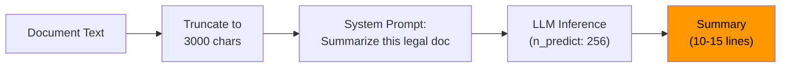
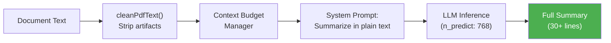
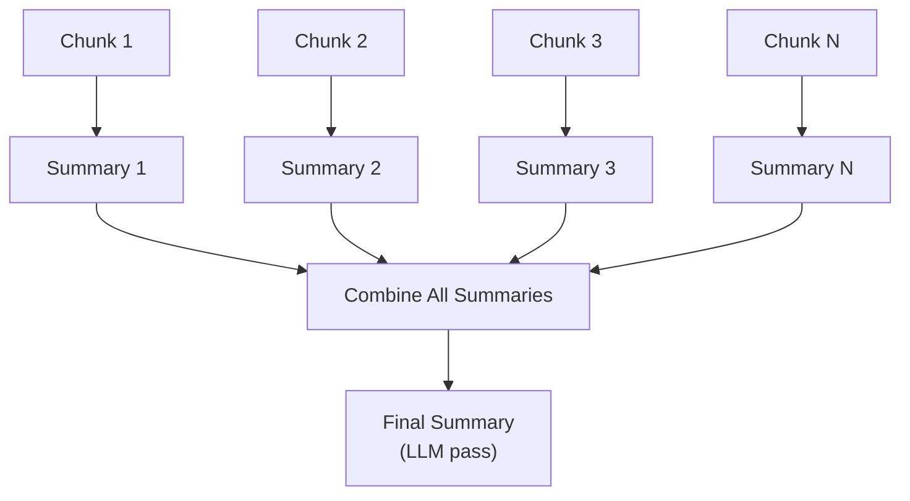
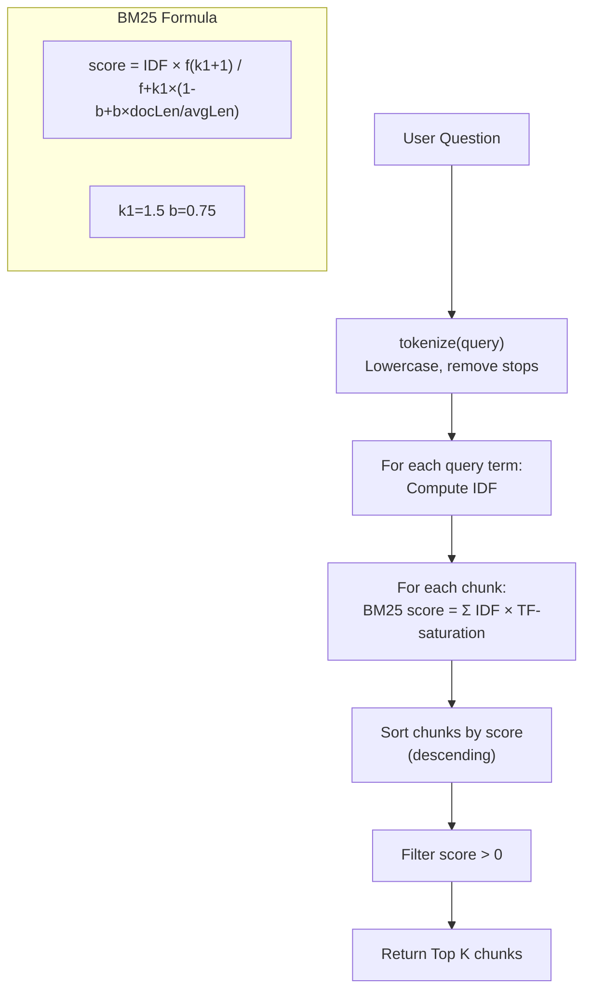
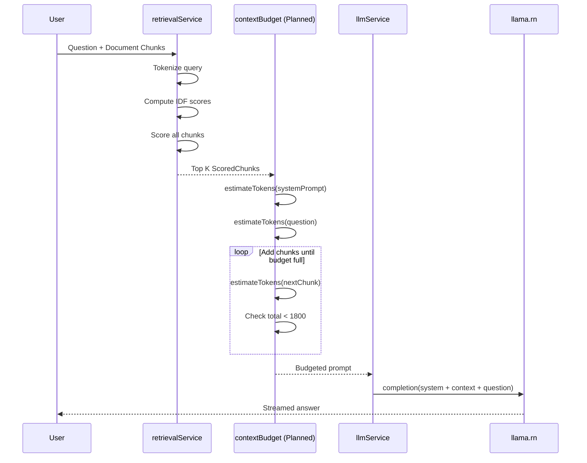

# Document Processing Strategy

## Problem

Large legal documents can exceed the model context window.

Examples:

- 50 page agreement
- 100 page case file
- 200 page legal notice collection

Sending the entire document to the model is not practical. Qwen 2.5 3B has a 2048-token context window configured (n_ctx), which is approximately 8,000 characters.

---

## Processing Pipeline Overview

---

## Upload Pipeline

### Chunking Strategy

---

## Summarization Pipeline

### Current Implementation

### Known Issues

- Only 10–15 lines of summary generated (token limit too low)
- Raw markdown/PDF formatting artifacts in output
- Large documents lose content beyond 3,000 characters

### Planned Fix (Phase 8 Part 3)

Future: Map-Reduce summarization:

---

## Question Answering Pipeline (RAG)

### BM25 Retrieval Algorithm

### Full RAG Flow

---

## Legal Audit Pipeline (Risk & Evidence)

### Risk Analysis

1. Scans document chunks contextually.
2. Identifies high-risk, medium-risk, and missing standard clauses based on `CaseType` and `LegalPerspective`.
3. Produces a Risk Confidence Score and specific questions to ask an attorney.

### Evidence Extractor

1. Identifies and categorizes evidentiary references within the text.
2. Classifies evidence into:
   - **Strong Evidence**: Signed documents, formal correspondence, timestamps.
   - **Weak Evidence**: Verbal assertions, unsigned annexures.
   - **Missing Evidence**: Items referred to but not included.

---

## Legal Strategy Pipeline

### SWOT Generator

1. Uses `strategyGenerator.ts` to build context.
2. Maps document text into:
   - **Strengths**: Strong claims, clear evidence.
   - **Weaknesses**: Missing clauses, poor formatting, contradictions.
   - **Opportunities**: Legal loopholes, missing opponent evidence.
   - **Threats**: Approaching deadlines, jurisdictional issues.
3. Compiles Legal Arguments and actionable Next Steps.

---

## Benefits

- Faster — only relevant chunks sent to LLM for RAG
- Deep Analysis — chunk-by-chunk iteration for Audit and Strategy
- Lower memory usage — small context window managed dynamically via KV cache clearing (`context.clearCache()`)
- Works with large PDFs — no document size limit
- Fully offline — no internet required
- Deterministic retrieval — same query always returns same chunks
