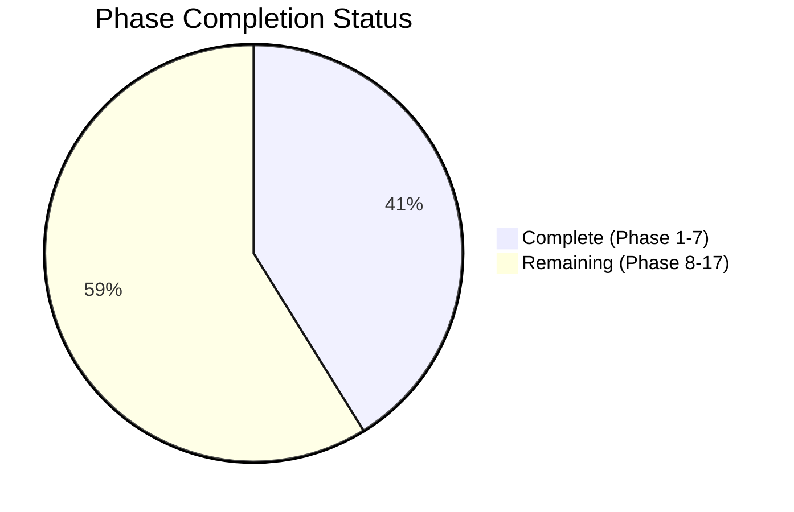
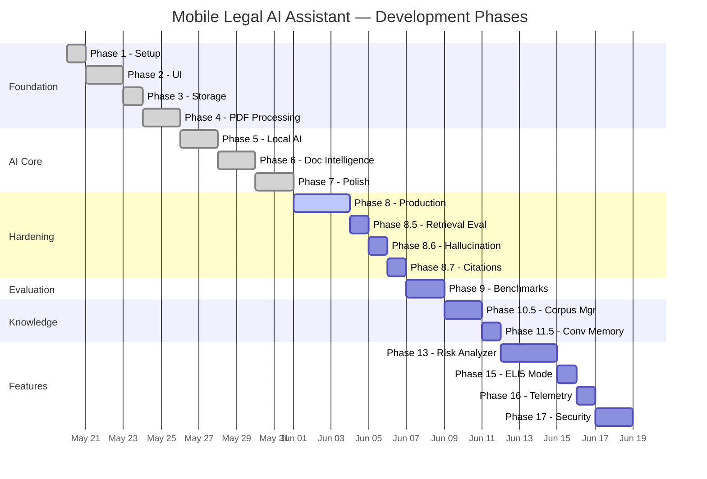

# Development Roadmap

## Progress Overview

## Timeline

## Phase 1 ✅

**Project Setup**

- Install Android Studio
- Install Android SDK
- Create React Native App (TypeScript)
- Run App Successfully on Emulator

---

## Phase 2 ✅

**UI**

- Home Screen with quick-action cards
- Chat Screen with message bubbles
- Documents Screen with upload and list
- Document Details Screen with summary and Q&A
- Settings Screen with model info

---

## Phase 3 ✅

**Local Storage**

- Save documents with Zustand + AsyncStorage
- List documents with metadata
- Delete documents with confirmation

---

## Phase 4 ✅

**PDF Processing**

- Upload PDF via native document picker (SAF-compatible)
- Extract text with custom PdfExtractor native module (PDFBox)
- Split into chunks (1000 chars, smart break points)

---

## Phase 5 ✅

**Local AI**

- Integrate llama.rn (React Native bindings for llama.cpp)
- Download and load Qwen 2.5 3B GGUF model
- Chat functionality with streaming token display

---

## Phase 6 ✅

**Document Intelligence**

- Summarization with LLM
- Question answering with BM25 retrieval (RAG)
- Relevant chunk selection and labeling

---

## Phase 7 ✅

**Polish & Model Management**

- Multi-model support (Qwen 3B, Qwen 1.5B, Llama 1B)
- Model download with progress bar
- Model switching with persistent preferences
- Auto-load on startup
- Stop/cancel generation button
- Indian Law specialization in system prompts
- Error handling and status indicators

---

## Phase 8 🔲

**Production Hardening**

- Model crash recovery (auto-release + reload)
- Token-based context budget manager
- Fix document summarization (increase token limit, clean PDF artifacts)

---

## Phase 8.5 🔲

**Retrieval Quality Evaluation**

- Retrieval benchmark suite (Recall@5, Recall@10, MRR, Precision)
- 10 benchmark documents + 50 benchmark questions
- Automated scoring scripts

---

## Phase 8.6 🔲

**Hallucination Detection**

- Answer verifier service
- Cross-reference answer claims against source chunks
- Warning banner when confidence is low

---

## Phase 8.7 🔲

**Source Citation Engine**

- Interactive citation panel below AI answers
- Tap source → view chunk → highlight paragraph
- Structured `CitationSource` data type

---

## Phase 9 🔲

**Evaluation Framework**

- Performance benchmark harness
- Model load time measurement
- Inference latency (ms/token)
- Peak RAM/memory consumption tracking

---

## Phase 10 🔲

**Real Legal Knowledge Base**

- Built-in Indian legal corpus (Constitution, BNS, BNSS, BSA, CPC, RTI)
- Chunk and index on first launch
- Answer questions without user-uploaded documents

---

## Phase 10.5 🔲

**Legal Corpus Manager**

- Modular `assets/legal/` directory structure
- Per-law metadata and versioning
- Incremental indexing

---

## Phase 11 🔲

**Hybrid Retrieval**

- BM25 + embedding model dual-stage retrieval
- Semantic search alongside keyword matching

---

## Phase 11.5 🔲

**Conversation Memory**

- 5-exchange history buffer
- Context summary injection for follow-up questions
- Multi-turn conversational awareness

---

## Phase 12 🔲

**Legal AI Assistant Features**

- Case Analysis (FIR, Charge Sheet, Notice, Agreement)
- Legal Drafting (Legal Notice, RTI, Consumer Complaint, Affidavit)
- Voice Mode (Speech → Transcription → RAG → TTS)

---

## Phase 13 🔲

**Legal Risk Analyzer**

- Upload contract → classify clauses (High / Medium / Low risk)
- Detect missing standard clauses
- Generate recommendations
- Color-coded Risk Report Screen

---

## Phase 14 🔲

**Document Comparison**

- Upload Contract V1 and V2
- Detect added, removed, and modified clauses
- Visual diff display

---

## Phase 15 🔲

**Explain Like I'm Not a Lawyer (ELI5)**

- Toggle for Simple English mode
- Dual output: Legal Explanation + Plain English Explanation

---

## Phase 16 🔲

**Performance Dashboard**

- Track: Model Load Time, Inference Time, Tokens/sec, Peak RAM
- Track: Document Count, Chunk Count, Storage Usage
- Display in Settings Screen

---

## Phase 17 🔲

**Security & Privacy**

- Encrypted AsyncStorage
- Encrypted PDF storage directory
- Secure model directory
- Local-only processing toggle
- Export / Delete all user data
