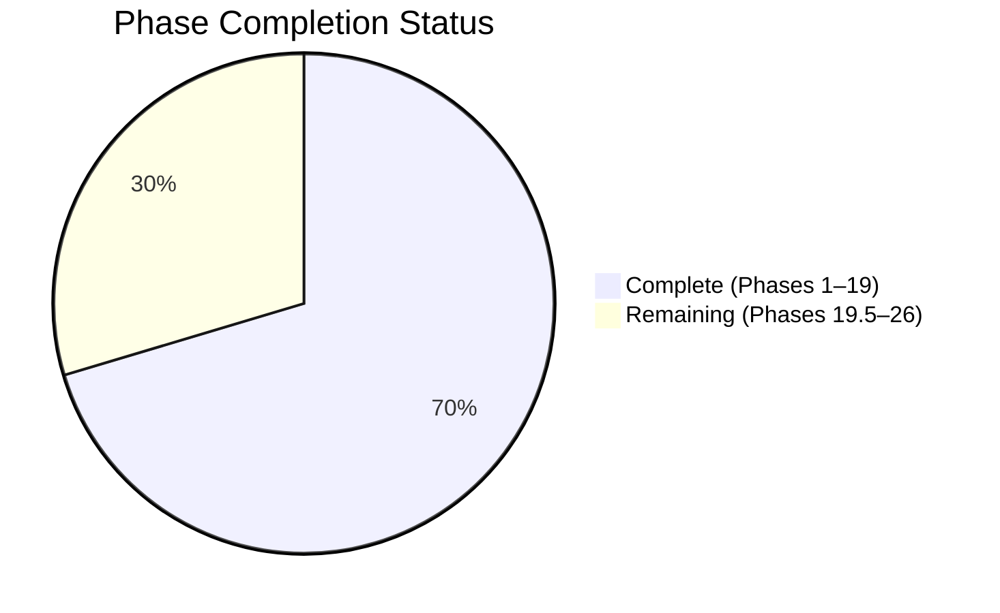
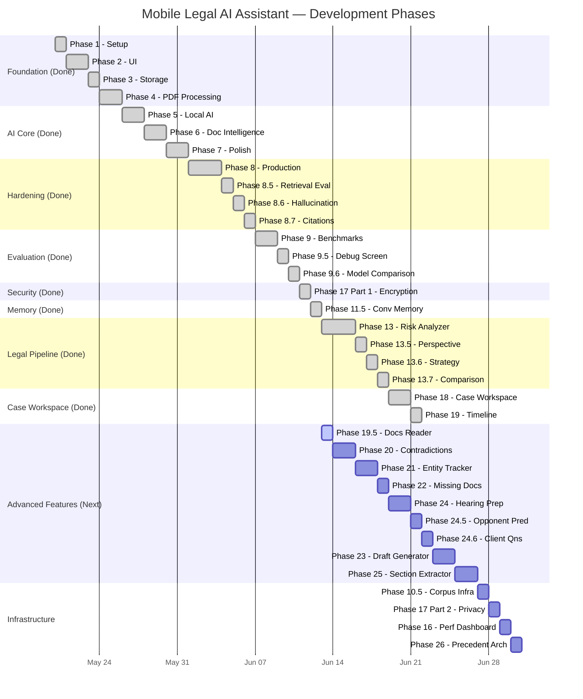

# Development Roadmap

## Progress Overview

## Execution Timeline (Revised)

---

## Phase 1 ✅

**Project Setup**

- Install Android Studio and Android SDK
- Create React Native App (TypeScript)
- Run App Successfully on Emulator

---

## Phase 2 ✅

**UI**

- Home Screen with quick-action cards
- Chat Screen with message bubbles
- Documents Screen with upload and list
- Document Details Screen with summary and Q&A
- Settings Screen with model info

---

## Phase 3 ✅

**Local Storage**

- Save documents with Zustand + AsyncStorage
- List documents with metadata
- Delete documents with confirmation

---

## Phase 4 ✅

**PDF Processing**

- Upload PDF via native document picker (SAF-compatible)
- Extract text with custom PdfExtractor native module (PDFBox)
- Split into chunks (1000 chars, smart break points)

---

## Phase 5 ✅

**Local AI**

- Integrate llama.rn (React Native bindings for llama.cpp)
- Download and load Qwen 2.5 3B GGUF model
- Chat functionality with streaming token display

---

## Phase 6 ✅

**Document Intelligence**

- Summarization with LLM
- Question answering with BM25 retrieval (RAG)
- Relevant chunk selection and labeling

---

## Phase 7 ✅

**Polish & Model Management**

- Multi-model support (Qwen 3B, Qwen 1.5B, Llama 1B)
- Model download with progress bar
- Model switching with persistent preferences
- Auto-load on startup, Stop/cancel generation button
- Indian Law specialization in system prompts

---

## Phase 8 ✅

**Production Hardening**

- Model crash recovery (auto-release + reload)
- Token-based context budget manager
- Fixed document summarization (increased token limit, PDF artifact cleaning)

---

## Phase 8.5 ✅

**Retrieval Quality Evaluation**

- Retrieval benchmark suite (Recall@5, Recall@10, MRR, Precision)
- 10 benchmark documents + 50 benchmark questions
- Automated scoring scripts in `src/evaluation/retrievalBenchmark.ts`

---

## Phase 8.6 ✅

**Hallucination Detection**

- `answerVerifier.ts` — cross-references answer claims against source chunks
- Warning banner displayed when confidence is low

---

## Phase 8.7 ✅

**Source Citation Engine**

- Interactive citation panel below AI answers
- Tap source → view chunk → highlight paragraph
- Structured `CitationSource` data type

---

## Phase 9 ✅

**Evaluation Framework**

- `performanceBenchmark.ts` — measures model load time, inference latency (ms/token), peak RAM
- `retrievalBenchmark.ts` — runs full 50-question suite with orchestrator

---

## Phase 9.5 ✅

**Retrieval Debug Screen**

- `DebugRetrievalScreen.tsx` — freeform query + document selector
- Output table: top 10 BM25 results with rank, chunk index, score, and expandable chunk preview
- Accessible from Settings → Developer Tools (dev builds only)

---

## Phase 9.6 ✅

**Model Comparison Benchmark**

- `modelComparison.ts` — `runModelComparison(modelIds[])` across all loaded models
- Collects: loadTimeMs, tokensPerSecond, peakRamMb, hallucinationScore, accuracyScore
- "Compare Models" tab in BenchmarkScreen

---

## Phase 11.5 ✅

**Conversation Memory**

- Last 10 messages (5 exchanges) retrieved and passed as history to `generateResponse()`
- History prepended as ChatML messages before current user message
- Persisted in `useChatStore` via Zustand middleware

---

## Phase 13 ✅

**Legal Audit & Risk Analyzer**

- `riskAnalyzer.ts` — chunk-by-chunk audit with `confidence`, `confidenceReason`, `lawyerQuestions[]`
- `evidenceAnalyzer.ts` — classifies Strong / Weak / Missing evidence per chunk
- `RiskReportScreen.tsx` — risk cards, evidence section, confidence banner, lawyer questions
- `interface RiskReport { highRisk, mediumRisk, missing, recommendations, confidence, lawyerQuestions }`

---

## Phase 13.5 ✅

**Perspective-Aware Legal Analysis**

- `LegalPerspective` type: neutral, plaintiff, defendant, accused, tenant, employer, consumer, etc.
- `CaseType` type: criminal, civil, consumer, employment, property, family, contract, tax, constitutional
- Global `selectedPerspective` + `selectedCaseType` state in `useChatStore` with Zustand persist
- `PerspectiveSelector.tsx` — horizontal chip rows for Perspective + CaseType
- `CASE_TYPE_FOCUS_MAP` injects perspective + case-type-specific legal focus into system prompt

---

## Phase 13.6 ✅

**Legal Strategy Generator**

- `strategyGenerator.ts` — `generateStrategy(chunks[], perspective, caseType): Promise<LegalStrategy>`
- `interface LegalStrategy { strengths, weaknesses, evidenceNeeded, possibleArguments, recommendedActions, confidence, lawyerQuestions }`
- `StrategyScreen.tsx` — structured strategy cards + confidence banner + lawyer questions

---

## Phase 13.7 ✅

**Multi-Perspective Comparison**

- `perspectiveComparison.ts` — runs strategy for two perspectives, merges into `ComparisonMatrix`
- Per-perspective confidence scores
- `PerspectiveComparisonScreen.tsx` — two-column comparison layout with shared lawyer questions

---

## Phase 17 Part 1 ✅

**Encrypted Storage**

- `secureStorage.ts` — wrapper around AES-encrypted AsyncStorage
- `secureSet()`, `secureGet()`, `secureDelete()` API
- `useCaseStore` and `storageService` migrated to `secureStorage` backend

---

## Phase 18 ✅

**Case File Workspace**

- `CaseFolder` schema: title, caseNumber, court, judgeName, clientName, caseType, status, nextHearingDate, documents[]
- `CaseStatus` type: consultation, notice_sent, filing, pending, evidence, arguments, disposed
- `useCaseStore.ts` — full CRUD with secureStorage persistence
- `CasesScreen.tsx` — case list sorted by upcoming hearing date
- `CaseDetailsScreen.tsx` — inline editable metadata, status chip selector, document link/unlink, workspace tools hub

---

## Phase 19 ✅

**Timeline Generator**

- `timelineGenerator.ts` — chunk-by-chunk date + event extraction with deduplication and contradiction flagging
- `TimelineScreen.tsx` — vertical timeline card list sorted by date, source document badge, red highlight on contradictions
- Accessible from Case Details workspace tools hub

---

## Phase 19.5 🔲 ← Next

**Docs Reader (Docx & Text Extractor)**

- `DocumentExtractorModule` — Native thread-safe parsing of Word `.docx` documents (parsing zip structure and `w:t` XML tags).
- Exposes `extractDocxText()` and `extractTxtText()` to React Native.
- File picker configuration in `DocumentsScreen.tsx` expanded to include `.docx` and `.txt` MIME types.

---

## Phase 20 🔲

**Contradiction Detector**

- `contradictionDetector.ts` — detects factual conflicts between two documents
- `ContradictionScreen.tsx` — two-doc picker, side-by-side conflict cards with severity badges
- Unlocks "Contradictions ⚠️" tool card in Case Details

---

## Phase 21 🔲

**Cross-Document Entity Tracker**

- `entityTracker.ts` — extracts and indexes persons, dates, amounts, case numbers across all case docs
- `EntityTrackerScreen.tsx` — grouped entity list, tap → see which documents the entity appears in
- Unlocks "Entity Tracker 👥" tool card in Case Details

---

## Phase 22 🔲

**Missing Document Detector**

- `missingDocDetector.ts` — CaseType-specific static checklists vs. uploaded documents
- `MissingDocsScreen.tsx` — ✅ Present / ❌ Missing view per CaseType
- Unlocks "Missing Docs 📂" tool card in Case Details

---

## Phase 24 🔲

**Hearing Preparation Mode**

- `hearingPrep.ts` — aggregates all case docs, single LLM synthesis into structured `HearingBrief`
- `HearingPrepScreen.tsx` — 7 sections: Key Facts, Dates, Arguments, Weak Points, Opponent Questions, Court Questions, Documents to Carry
- Unlocks "Hearing Prep ⚡" tool card in Case Details

---

## Phase 24.5 🔲

**Opponent Argument Predictor**

- `opponentPredictor.ts` — predicts likely opposing arguments and generates counterarguments
- `OpponentPredictorScreen.tsx` — two sections: Likely Arguments vs. Your Counterarguments
- Not win prediction — litigation prep only
- Unlocks "Opponent Predictor 🎯" tool card in Case Details

---

## Phase 24.6 🔲

**Questions for Client**

- `clientQuestionGenerator.ts` — generates CaseType-specific client interview questions from doc gaps
- `ClientQuestionsScreen.tsx` — numbered questions (copyable), Evidence Needed, Urgent Items sections
- Unlocks "Client Questions ❓" tool card in Case Details

---

## Phase 23 🔲

**Draft Generator Templates**

- `draftGenerator.ts` — structured prompt templates for 7 Indian legal document types
- `DraftGeneratorScreen.tsx` — template picker, context form, generated draft with copy-to-clipboard
- Templates: Legal Notice, Consumer Complaint, Reply Notice, RTI Application, Affidavit, Bail Petition Skeleton, Written Statement Skeleton
- Accessible from Case Details ("Draft Notice 📝") and Home Screen

---

## Phase 25 🔲

**Section Extractor (Indian Law)**

- `sectionExtractor.ts` — regex + LLM hybrid extraction of IPC/BNS/BNSS/CPC/BSA sections
- `explainSection()` — ingredients, burden of proof, penalty, relevant defenses
- `SectionExtractorScreen.tsx` — grouped by Act, tap → expand for explanation
- Accessible from Case Details and Document Details

---

## Phase 10.5 🔲

**Legal Corpus Infrastructure** (no ingestion)

- `assets/legal/` directory structure with per-law `metadata.json` and README placeholders
- `corpusManager.ts` — `listCorpusModules()`, `loadCorpusModule()`, `searchCorpus()`
- No corpus text ingested yet — interface only. Ingestion deferred to Phase 10.

---

## Phase 17 Part 2 🔲

**Privacy Controls UI**

- `SettingsScreen.tsx` — Privacy & Security card
- Local-Only Processing toggle (informational, always ON)
- Export All Data (JSON metadata export)
- Delete All Data (double-confirm, must type "DELETE")

---

## Phase 16 🔲

**Performance Dashboard**

- `telemetry.ts` — singleton tracking modelLoadTimeMs, lastInferenceTimeMs, tokensPerSecond, peakRamMb
- Updated by `modelManager` and `llmService` after each operation, persisted to AsyncStorage
- `SettingsScreen.tsx` — Performance card showing all 7 metrics

---

## Phase 26 🔲

**Precedent Architecture Placeholder**

- `precedentService.ts` — interface-only stub, returns empty arrays
- Hook points documented for future Indian Kanoon API or offline corpus integration
- `interface Precedent { caseName, court, year, sections[], summary, url? }`

---

## Deferred / Dropped Features ⛔

| Feature | Reason |
|---|---|
| Phase 11 — Hybrid Retrieval | BM25 sufficient for single-lawyer app. +80–100 MB. Revisit post-production. |
| Phase 12 — Voice Mode | High complexity, marginal value for lawyers |
| Phase 14 — Document Comparison | Low priority vs. evidence and strategy pipeline |
| Phase 15 — ELI5 Mode | Targeting working lawyers — legal language is required |
| Court/Win/Judgment Prediction | Legally irresponsible — permanently banned |
